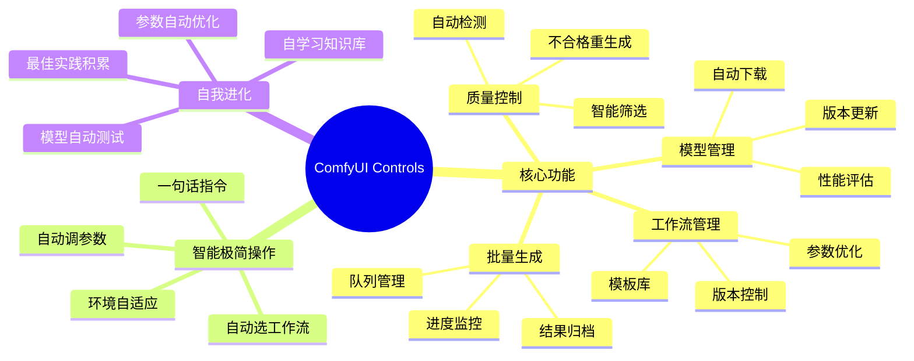

[](https://www.python.org/)
[](LICENSE)
[](https://github.com/comfyanonymous/ComfyUI)

# ComfyUI Controls Skill

> **ComfyUI 智能管理与控制框架** —— 让 ComfyUI 从工具变成自动出产品的智能体。工作流管理 + 模型进化 + 批量生成 + 质量控制，全链路自动化。

## 姊妹项目

| 项目 | 定位 |
|------|------|
| [ai-video-editor](https://github.com/beimeibeile/ai-video-editor) | AI视频剪辑框架 |
| [anysearch-skill](https://github.com/beimeibeile/anysearch-skill) | 深度搜索技能 |
| **Comfyui-controls-skill** | ComfyUI智能管理与控制（本项目） |

## 架构脑图



## 核心能力

| 能力 | 说明 |
|------|------|
| **工作流智能管理** | 工作流模板库、版本控制、参数优化、一键运行 |
| **模型自动进化** | 模型下载、更新、版本管理、自动测试、性能评估 |
| **批量出产品** | 批量生成、队列管理、进度监控、结果归档 |
| **质量门控制** | 生成结果质量检测、自动筛选、不合格重生成 |
| **API统一封装** | 统一接口调用ComfyUI，屏蔽版本差异 |
| **自我学习进化** | 从生成结果中学习优化参数、积累最佳实践 |
| **算力监控** | GPU使用监控、队列管理、资源调度 |
| **环境自适应** | 自动检测ComfyUI版本、可用模型、插件状态 |

## 快速开始

```bash
# 1. 克隆项目
git clone https://github.com/beimeibeile/Comfyui-controls-skill.git
cd Comfyui-controls-skill

# 2. 配置环境
cp .env.example .env
# 编辑 .env，填入 ComfyUI 地址

# 3. 验证连接
python -c "from capabilities.cap_api_wrapper import ComfyAPI; api = ComfyAPI(); print(api.get_system_stats())"
```

## 环境要求

| 组件 | 必需？ | 说明 |
|------|--------|------|
| **Python** | ✅ 必需 | ≥ 3.10 |
| **ComfyUI** | ✅ 必需 | 运行中，默认 http://127.0.0.1:8188 |
| **GPU** | ⚡ 推荐 | NVIDIA CUDA，显存 ≥ 8GB |
| **FFmpeg** | 可选 | 视频后处理 |

## 项目架构

```
Comfyui-controls-skill/
├── capabilities/              # 能力模块（可插拔）
│   ├── cap_workflow_manager/      # 工作流管理
│   ├── cap_model_manager/         # 模型管理
│   ├── cap_batch_generator/       # 批量生成
│   ├── cap_quality_control/       # 质量控制
│   ├── cap_api_wrapper/           # API封装
│   └── cap_self_evolution/        # 自我进化
├── workflows/                 # 工作流模板库
├── knowledge/                 # 知识库（自学习）
├── scripts/                   # 工具脚本
├── utils/                     # 工具函数
├── SKILL.md                   # 技能定义
└── README.md                  # 项目说明
```

## License

[MIT](LICENSE)
